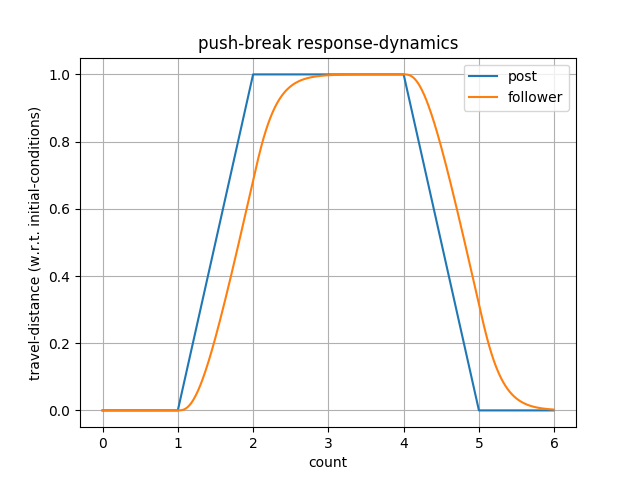

# SwingPy

> A west coast swing dance pattern generator written in python.

[](https://www.gnu.org/licenses/gpl-3.0)
[](https://travis-ci.com/capsulecorplab/SwingPy)
[](https://coveralls.io/github/capsulecorplab/SwingPy?branch=dev)
[](http://makeapullrequest.com)

The goal of this project is to mathematically model the physics of west coast swing dance patterns, in order to generate new combinations of patterns and to uncover why certain combinations or stylizations of patterns are better suited for musicality.



## Background

West Coast Swing (WCS) is a style of partner-dance, danced to a variety of music (s.a. blues, country, and modern-contemporary). Unlike most other style of dances, it can be difficult to add musicality to WCS. This is often due to most 4/4 [time-signature](https://en.wikipedia.org/wiki/Time_signature) music consisting of an "accent" or "break" on the odd count of every new measure or phrase change. In "dance-speak", this translates to beats counted in sets of 8 (a.k.a. "8-count") where an accent would often fall on the 1st count. However, not all WCS patterns are 8-counts long, and not all patterns are inherently accented on their odd counts. Therefore, dancers (particularly, leaders) must be mindful of the timing, combination, or stylization of patterns, if they wish to abide by musicality principles.

## Model Formulation

The leader's post, in connection with the follower, are modeled as a critically damped mass-spring-damper system (see free-body diagram below)

```
            --> x_f   --> r
            |         |
     _______     k
    |       |---/\/---|
    |   m   |         |
    |_______|---[=]---|
                 c

Equation(s) of Motion: m*x_f'' = - k*x_f - c*x_f'' + k*r
m: 'mass' of follower
x_f: follower's travel-distance from initial position along slot
r: travel-distance from initial position of post along slot
k: 'stiffness' in connection
c: damping coefficient in connection

State-Space Model: x'' = A*x + B*u
Output: y = C*x + D*u
State Variables: x = [x_f, x_f']
Input: u = [r]
```

Note: The above model only accounts for translational movement along one dimension. Hence, next steps will be to expand this state space model to allow for more complex dynamics.

## Contents
* `swingpy` contains the source code for the python package.
* `tests` contains unit tests written with [pytest](https://docs.pytest.org/en/latest/).
* `docs` (coming soon)

## Development pipeline
This project is still very much in early development. Future features in consideration include, but not limited to:
- Animation plug-in for visualizing the pattern generators in real-time.
- Parser for reading midi files
- Some sort of GUI

For any questions, comments, or feature requests, please feel free to submit a [new issue](https://github.com/capsulecorplab/SwingPy/issues/new).

## Usage

(Option 1) (recommended for new python users)

Run script on [Colaboratory](https://colab.research.google.com/drive/1w8QATZCc7FaVq6Re15yd_2i7QHLpkXWn)

(Option 2) (coming soon)

Install `swingpy` from PyPI:
```
$ pip install swingpy
```

(Option 3)

Install `swingpy` from source code:
```
$ pip install git+https://github.com/capsulecorplab/SwingPy.git
```

A sugar push plot can be generating using `matplotlib`. In a python IDE, import `swingpy` as a python package:
```
>>> from swingpy import wcs
>>> import matplotlib.pyplot as plt

>>> jnj = wcs.OpenPosition()
>>> t, y, u = jnj.sugarpush()

>>> plt.plot(t, u)
>>> plt.plot(t, y)
>>> plt.grid(which='major')
>>> plt.title('push-break')
>>> plt.ylabel('travel-distance (w.r.t. initial-conditions)')
>>> plt.xlabel('count')
>>> plt.legend(['Post','Follower'])
>>> plt.show()
```

(Option 4)

Clone `swingpy`:
```
$ git clone https://github.com/capsulecorplab/SwingPy.git
```

Generate plot by running `wcs.py` as a python script:
```
$ cd SwingPy
$ python3 swingpy/wcs.py
```

Tests can also be run using pytest from root project directory:
```
$ cd SwingPy
$ pytest -v
```

## Contribute

Optional (but recommended for viewing GitHub issues): Install the [ZenHub for GitHub](https://chrome.google.com/webstore/detail/zenhub-for-github/ogcgkffhplmphkaahpmffcafajaocjbd?hl=en-US) chrome extension.

1. Fork it (<https://github.com/yourusername/SwingPy/fork>)
2. Create your feature branch (`git checkout -b feature/logarithms`)
3. Commit your changes (`git commit -am 'Add some logarithms'`)
4. Push to the branch (`git push origin feature/logarithms`)
5. Create a new Pull Request
